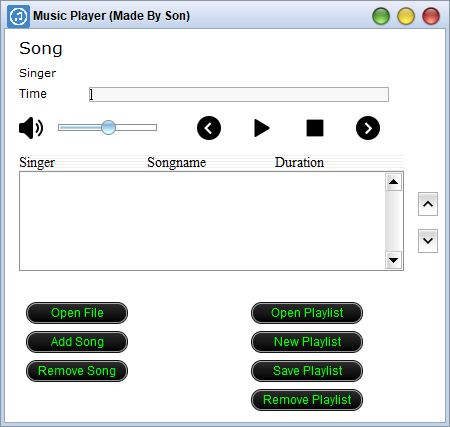

=======

<!--<figure>
	
</figure>
 -->

<strong> Simple mp3 player using java </strong> 
 

컴퓨터공학과를 들어가고 처음으로 해본 팀 프로젝트였다. 공부와는 거리가 먼 시절이었기때문에 전공 관련해서 이 프로젝트만이 가장 기억에 남는다.

## 기능
* 기능은 정말 간단하다. 다른 MP3와 같이 기본적으로 <b>재생, 정지, 일시정지</b> 기능이 제공되고 <b>볼륨바와 진행바</b>를 마우스를 통해 조작이 가능하다.
* 하단의 7개 버튼을 통해 나만의 재생목록을 만들 수 있고 윈도우 파일시스템 상에 저장이 가능하다.

## 디자인
 * Java에서 제공하는 Swing을 사용하였다. 편리하게 마우스로 드래그 앤 드롭만 하면 자동으로 GUI기능이 구현 가능해서 편리했다.

## 후기
 * 처음으로 코딩을 통해 결과물을 만든 프로젝트라 뿌듯했다. 개발에 재미를 느끼게 해준 프로젝트였고 이 프로젝트를 계기로 군대에서 열심히 코딩공부를 시작했다.
